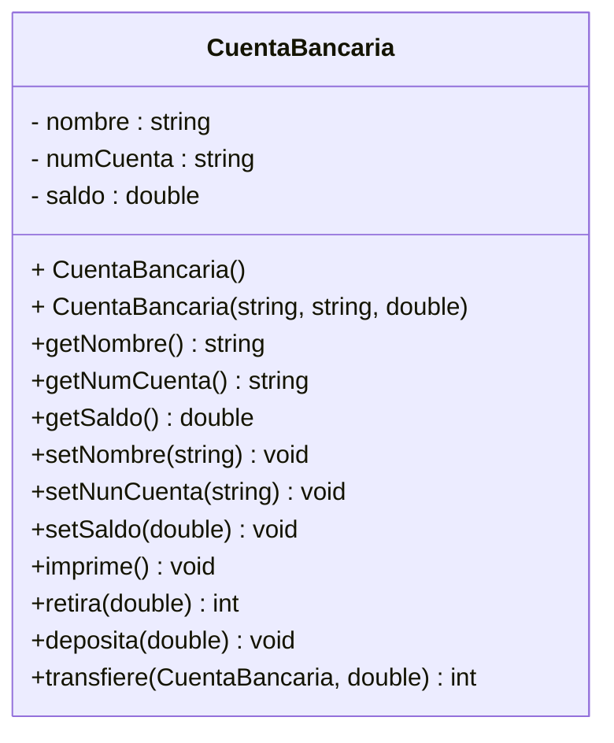

# Ejercicio-Autograding para C++ usando Catch2

**Fuente:** *Learning Autograding with C/C++ and Catch2 - Prof. Igor Machado Coelho* 
https://medium.com/swlh/easy-c-autograding-on-github-classroom-with-catch2-106ad1107402

## Descripción del Problema

Escenario: En un banco de una ciudad de un pueblo lejano donde la tecnología no ha llegado, necesitan un sistema que maneje las cuentas bancarias de sus clientes. Las cuentas bancarias deben tener los siguientes datos básicos, el nombre del cliente, el numero de cuenta y el saldo. Con una cuenta bancaria debemos poder depositar, retirar y transferir a otra cuenta del mismo banco.

## Diagrama de Clases


## Objetivo

- Busca que el código pase correctamente todas las pruebas
   * Solamente cambia los archivos permitidos para lograr este objetivo (abajo se indican las reglas específicas)
   
- Las GitHub Actions deberán presentar una palomita en verde si se han satisfecho todas las pruebas, y una cruz roja cuando alguna (o todas) las pruebas han fallado.
   * **Recomendación:** Puedes dar clic en la cruz roja para verificar cual de las pruebas ha fallado (o si el código no ha compilado correctamente).

## Instrucciones

- Revisa el código de la definición de la clase (archivo header extensión hpp).
- Entra al archivo `CuentaBancaria.cpp` e implementa los métodos:
    * **Constructor default**
    * **Constructor con parámetros.**
    * **Getters y setters**, guíate por el diagrama UML presentado
    * Método **imprime**, que despliega a pantalla la información de la cuenta en el siguiente formato: 
    
    ```
    Cuenta: 98765443211
    Fabiola Uribe Plata
    Saldo: $500.5
    ``` 

    * Método **retira** que recibe una cantidad double a retirar, el método revisa si se puede hacer ese retiro, si es así lo descuenta del saldo y regresa un 1, si no se puede hacer ese retiro, se devuelve un 0.
    * Método **deposita** que recibe una cantidad double a depositar, el método actualiza el saldo agregando la cantidad indicada por el parámetro.
    * Método **transfiere** que recibe una CuentaBancaria y un valor double, si el saldo de *esta* cuenta permite el transpaso de la cantidad recibida como parámetro, se descuenta la cantidad del saldo y se actualiza también el saldo de la cuenta repectora (CuentaBancaria que llega como parámetro), devuelve un 1 si se pudo hacer la transferencia o un 0 si no se pudo realizar.
    * Una vez que termines tu clase pruébala creando en el `excercise.cpp` 2 objetos CuentaBancaria, uno con el constructor default y otro con el constructor con parámetros y prueba todos los métodos para que te asegures que todo trabaja adecuadamente.
    * **Debes respetar el diseño de la clase** es decir si te dice tu método que debe recibir una CuentaBancaria y un double, así impleméntalo. No cambies nada del diseño porque de lo contrario el autograder te va a calificar como que no cumples.

 *Explicación de los otros archivos*:

- Archivo `test/tests.cpp` tiene las pruebas de esta actividad (NO LO CAMBIES!)
- Archivo `test/catch.hpp` tiene la biblioteca de pruebas  CATCH2 (NO LA CAMBIES!)
- Archivo `makefile` tienes los comandos para ejecutar la actividad (NO LO CAMBIES!)
- Archivo  `./build/appTests` se generará después de compilar (para **pruebas locales**, solo ejecútalo)

## Comandos para pruebas locales, ejecución y depuración

- Comando para construir y ejecutar pruebas: `make` o `make test`
    * Si el ejecutable ya está construido, sólo teclea : `./build/appTests`

- Comando para construir y ejecutar la aplicación: `make run` 
    * Si el ejecutable ya está construido, sólo teclea : `./build/exercise`

- Comando para depurar: `make debug`
    * Para conocer los comandos de depuración consulta:
     https://u.osu.edu/cstutorials/2018/09/28/how-to-debug-c-program-using-gdb-in-6-simple-steps/
     
- Comando para depurar programa principal : `make debugvs` 
    * Utilizar el depurador de la IDE.     

- Comando para depurar pruebas : `make debugtest` 
    * Utilizar el depurador de la IDE.     

## Notas

- El código será evaluado solamente si compila.
   * La razón de esto es, si no compila no es posible generar el ejecutable y realizar las pruebas.

- Algunos casos de prueba podrían recibir calificación individual, otros podrían recibir calificación y si pasan todos juntos (o todas las pruebas en conjunto).

- La calificación final se otorgará de manera automática en cada *commit*, y se evaluará solamente hasta la fecha limite de la actividad.

Para dudas adicionales, consulta a tu profesor.

## License

MIT License 2020
